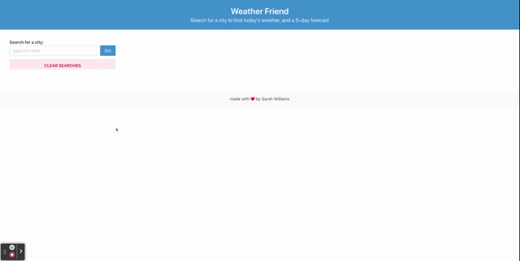

# 06 Weather Dashboard

## Description

This interactive weather app allows you to enter a city name into the search bar to get information about its current and upcoming weather. The display includes:

- A daily forecast with today's date, weather icon, forecast, temperature, humidity, and wind speed
- An interactive Ultra Violet Index display with shows green if the UVI is low, yellow if it is middling, and red if it is high
- A five-day forecast that includes date, weather icon, temperature, wind, and humidity

The app also includes a search history that saves and displays past cities searched. Click on each city in the history to reload its weather information, so you can always stay informed about your favorite locations.

If your search history gets too cluttered, click the 'Clear Searches' button to clear out your history and start fresh.

## Technologies and Resources Used

- HTML
- Bulma (styling)
- JavaScript
- Moment (date formatter)

## Links for repo and live page

- Github Page: https://sarahlophus.github.io/weather.board/
- Github Repo: https://github.com/Sarahlophus/weather.board
